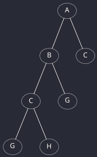
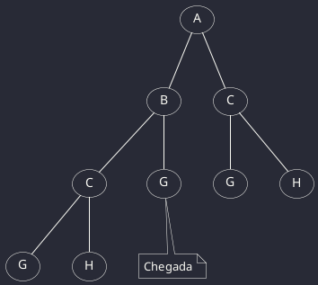
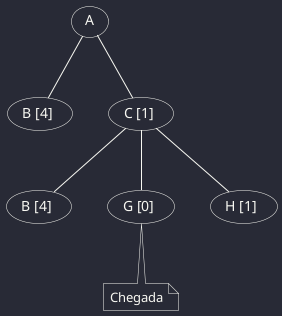
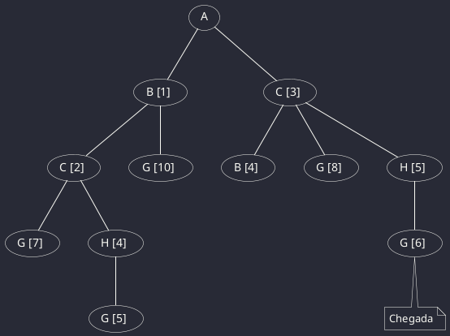

# Introdução à Inteligência Artificial

## **Métodos de Pesquisa**

**Pesquisa não Informada:**
- Profundidade
- Largura
- Uniforme

**Pesquisa Informada:**
- Sôfrega: h
- A* = f = g + h

Deve-se definir uma heuristica que seja admissível, ou seja, menor ou igual ao custo real.
Quanto melhor o h, melhor o desempenho do algoritmo.

```plantuml
@startuml
skinparam shadowing false
skinparam backgroundColor #282a36
skinparam DefaultFontColor #f8f8f2

skinparam defaultFontName sans-serif
skinparam classFontSize 14

skinparam usecase {
    BackgroundColor #282a36
    BorderColor #f8f8f2
    ArrowColor #f8f8f2
}

together {
    (A)
    (B)
    (G)
}

(A) as A
(B) as B
(C) as C
(G) as G
(H) as H

A -- B: 1
A -- C: 3

B -- C: 1
B -- G: 9

C -- G: 5
C -- H: 2

H -- G: 1
@enduml
```

O objetivo é encontrar o caminho de A para G.

---

### **Método de Profundidade:**

Para este método o custo não conta. Aqui expandimos sempre o ramo mais à esquerda e apenas este.

---

### **Método de Largura:**

Para este método o custo não conta. Aqui abrimos sempre todos os ramos possíveis, da esquerda para a direita, ate atingirmos o ojetivo.

---

### **Método da Sôfrega:**

Seja h(A) = 5, h(B) = 4, h(C) = 1, h(H) = 1, h(G) = 0.

Para este método o custo esperado (sôfrega) é tido em conta. Aqui expande-se o ramo que parece mais perto do objetivo.

---

### **Método do Custo Uniforme:**

Para este método o custo real (uniforme) é tido em conta. Aqui expandem-se todos os ramos e escolhe-se a situação onde custa menos chega ao objetivo.

**[Página Inicial](../../../index.md) | [Página Anterior](./Main.md)**