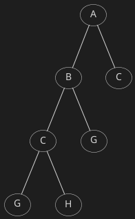

```plantuml
@startuml
skinparam shadowing false
skinparam handwritten flase
skinparam backgroundColor #1E1E1E
skinparam DefaultFontColor #d4d4d4

skinparam defaultFontName sans-serif
skinparam classFontSize 14

skinparam usecase {
    BackgroundColor #1E1E1E
    BorderColor #d4d4d4
    ArrowColor #d4d4d4
}

together {
    (A)
    (B)
    (G)
}


(A) as A
(B) as B
(C) as C
(G) as G
(H) as H

A -- B: 1
A -- C: 3
B -- C: 1
B -- G: 9
C -- G: 5
C -- H: 2
H -- G: 1
@enduml
```

 

```plantuml
@startuml
skinparam shadowing false
skinparam handwritten flase
skinparam backgroundColor #1E1E1E
skinparam DefaultFontColor #d4d4d4

skinparam defaultFontName sans-serif
skinparam classFontSize 14

skinparam usecase {
    BackgroundColor #1E1E1E
    BorderColor #d4d4d4
    ArrowColor #d4d4d4
}

(A) as A
(B) as B
(C) as C1
(C) as C2
(G) as G1
(G) as G2
(H) as H
A -- B
A -- C1
B -- C2
B -- G1
C2 -- G2
C2 -- H

@enduml
```

